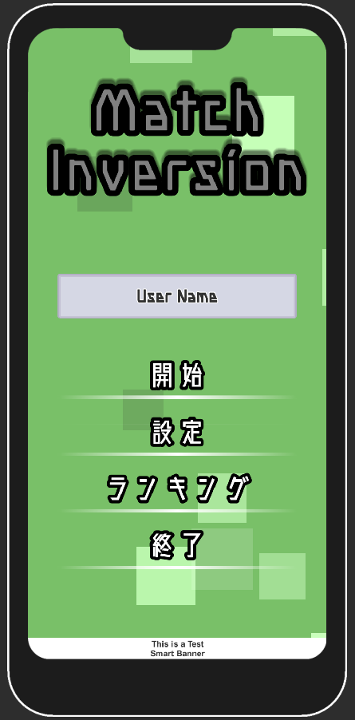
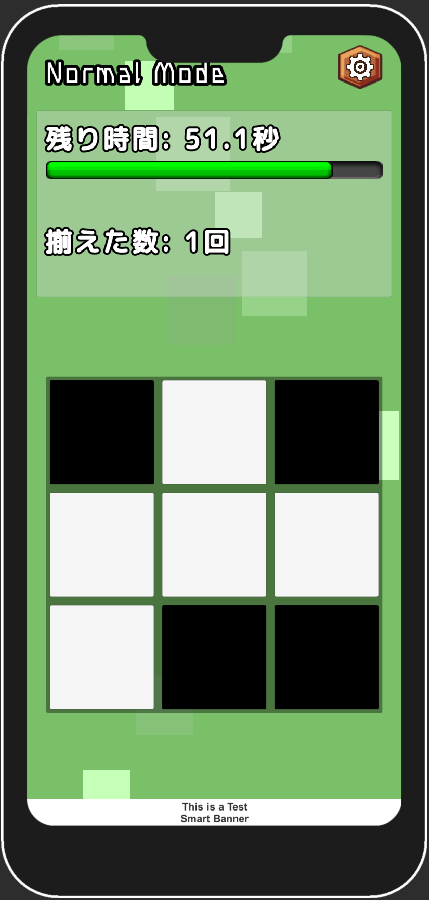
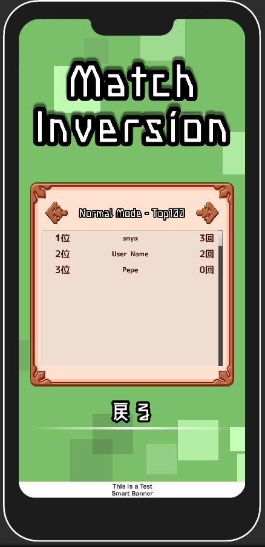

# Match Inversion
## 概要  
>ジャンル: パズルゲーム  
>制作人数: 1人  
>製作期間: 2週間  
>制作時期: 4年次  
>>#### 開発環境
>>エンジン: Unity  
>>言語: C#  
>>ツール: Paint.net  
>>使用アセット: DoTween, Unity Ads, Play Fab
>>#### 実行環境:
>>>##### PC
>>>OS: Windows 10  
>>>RAM: 8GB  
>>>GPU: Intel i5-8250U  
>>>##### スマートフォン  
>>>OS: Android 12  
>>>デバイス: Xperia 10 III  
>>>RAM: 6GB  
>>>CPU: Qualcomm® Snapdragon™690 5G Mobile Platform  
  
## ゲーム内容  
タップしたマスと十字の方向が色が反転し、その3x3のマスをすべて同じ色にするゲーム。
60秒間の間に何回揃えられたかオンラインランキングで競うことが出来る。  
現在は2種類のモードが存在しており、通常のモードである「Normal Mode」と、
通常のルールに加え1盤面あたりに操作できる回数が決まっている「Limited Mode」がある。  
  
### [Google Play](https://play.google.com/store/apps/details?id=com.DiceGearProject.MatchInversion)
  
## 開発目的  
あまりスマホゲームを作ってこなかったので、就活に向けてスマホゲームを作るという目的で作り始めた。
せっかくスマホゲームを作るなら、広告収入とGoogle Play Storeに出品して見たいという目標も建てた。  
結果としては、6円ほどというかなり少ない金額ではあるものの、自分で作った作品で稼ぐことが出来たので、
これを糧にさらに良い作品を作っていきたいと思う。  
  
## 頑張った点
- 様々な端末に対応できるUI
- DoTweenによるUIのアニメーション
- Unity Adsによる広告の表示 
- Play Fabを利用したオンラインランキング  
- ステートパターンを利用したゲーム進行状況の管理  
  
## スクリーンショット
  
### [プレイ動画 - Youtube](https://www.youtube.com/watch?v=WJsJ68m9RAc)  
  

